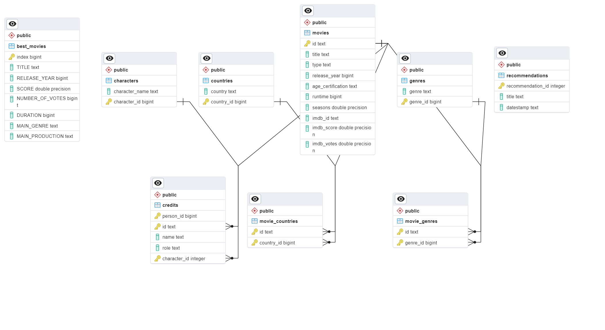

# Netflix Data Analysis Project

This project is designed to analyze Netflix data to provide insights and recommendations based on movie titles. It includes data cleaning, normalization, database setup, and an API for data manipulation.

## Project Structure

The project is structured as follows:

- `analyzer/`: Contains files to access data in the database.
- `api/`: Contains the API interface for data operations.
- `config/`: Configuration files for the database and logging.
- `data/`: The directory where raw and processed data is stored.
- `database/`: Database connection modules.
- `docs/`: Documentation files, including the Entity Relationship Diagram (ERD).
- `logging/`: Log files are output here.
- `recommender/`: Logic for movie recommendation system.
- `scripts/`: Data cleaning and normalization scripts.
- `tests/`: Integration and unit tests for the application.
- `main.py`: main code for taking care of raw data, constraints, permissions and pushing them to PostSQL database.

## Pre-requisites

- Python 3.8 or higher
- PostgreSQL
- Poetry for Python packaging and dependency management

## Dataset

- [Access the Netflix TV Shows and Movies (2022 Updated)](https://www.kaggle.com/datasets/thedevastator/the-ultimate-netflix-tv-shows-and-movies-dataset?select=Best+Shows+Netflix.csv): This link will direct you to the Kaggle dataset where you can download the "Netflix TV Shows and Movies (2022 Updated)" dataset. Please download and save these datasets to the `data` folder for processing.

## Installation

First, clone the repository to your local machine:

```sh
git clone https://github.com/Prasalaitis/MovieRecommender.git Capstone
```

Install the project dependencies using Poetry or pip:

```sh
poetry install
```

or:

```sh
pip install -r requirements.txt
python setup.py install
```

## Database config

Configure your database settings by creating a `.env` file in the project root with the following contents:

```env
NETFLIX_DB_HOST=localhost
NETFLIX_DB_NAME=your_database_name
NETFLIX_DB_USER=your_database_user
NETFLIX_DB_PASSWORD=your_database_password
```

## Data Normalization, Constraints, Permission, Loading

Set up your data, database schema and constraints:

```sh
poetry run python -m main
```

or
```sh
python -m main
```

## Running Tests

To ensure everything is set up correctly, run the tests:

```sh
poetry run python -m unittest discover tests
```

or
```sh
python -m unittest discover tests
```

## Running the Recommender System

To generate movie recommendations:

```sh
poetry run python -m recommender.recommender
```

or
```sh
python -m recommender.recommender
```

# Netflix Data Analysis Tools

This guide explains how to use the `analyzer.py` command-line tool and the `analyzer.ipynb` Jupyter notebook for data analysis on Netflix data.

### Using analyzer.py (Command-Line Tool)

`analyzer.py` is a command-line tool that allows you to execute SQL queries directly on the Netflix database.


#### Usage
Run the `analyzer.py` script with a SQL query as an argument. For example:

```sh
poetry run python -m analyzer.analyzer "SELECT * FROM best_movies LIMIT 5"
```

or
```sh
python analyzer.analyzer "SELECT * FROM best_movies LIMIT 5"
```

### Using analyzer.ipynb (Jupyter Notebook)
analyzer.ipynb is a Jupyter notebook for running SQL queries interactively and analyzing Netflix data.

#### Usage
Write your SQL queries as strings and execute them using the api.select_data(query) method.


## Database Design

Below is the Entity-Relationship Diagram (ERD) for the Netflix database, illustrating the structure and relationships of the database tables:



